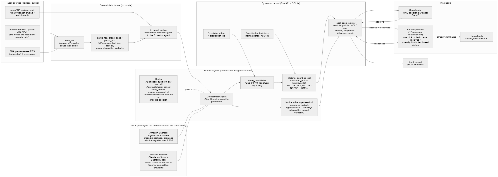

# Recall Relay

**Every recall, every pantry, with proof.**

Recall Relay is a Strands Agents application that runs a food bank's recall procedure across its partner pantries. It reads FDA recall notices, matches them against the food bank's receiving ledger and distribution log, builds the pull list, drafts the notices, asks a human for **one** decision, relays the notices to every affected pantry, chases confirmations from volunteer pantries that may not open for weeks, and files the audit packet a food-safety auditor asks for.

Built for the AWS **Agents for Humans** hackathon, Good Neighbor track, September 2026. Apache-2.0.

- Live demo: `LIVE_DEMO_URL`
- Video: `VIDEO_URL`
- Architecture diagram: [docs/architecture.png](docs/architecture.png)

---

## The problem

When the FDA posts a food recall, Feeding America's national office emails every member food bank. That part works. What happens next is one coordinator, a spreadsheet, and a network of 50 to 500 partner agencies: church pantries, soup kitchens, school pantries, shelters, most of them volunteer-run, some open once a month.

Someone has to cross-check the notice against receiving records that rarely captured a lot code, figure out which agencies took cases and when, email each one, chase confirmations, and produce the record the food-safety audit and the annual mock-recall drill require. And nobody reaches the household that already took the box home.

The demo is built on a real recall. On September 2, 2026, Frutas y Hortalizas del Sur S.A. expanded a recall to one lot of Great Value Organic Triple Berry Blend, 10 oz, sold at Walmart stores in 27 states including Florida, for possible E. coli O145. Walmart retail rescue is how a lot of frozen food reaches South Dade pantries. In the seeded ledger, 30 cases arrived August 24 with no lot code on the receipt, and 22 of them shipped to three pantries between August 26 and September 4. That last shipment went out two days after the press release, because nobody had cross-checked the ledger. That is the whole problem in one row.

## Who it is for

A regional or independent food bank's partner-agency network: one food-safety or agency-relations coordinator, the partner agencies, and the households those agencies serve. The demo cohort is a fictional South Dade Community Food Bank in Miami-Dade County with 12 partner agencies, a 60-row receiving ledger, and a 140-row distribution log. The recall notices are real. The food bank is not.

## What the agent does, end to end

1. **Intake** a recall from any source: a forwarded alert, a pasted FDA URL or notice text, an uploaded PDF, the FDA press-release RSS feed (same day), or the weekly openFDA enforcement ledger. Each becomes a typed `RecallNotice`. Non-food items (drugs, devices, pet food) are filtered out.
2. **Match** it against the ledger. Deterministic scoring narrows the ledger to a handful of candidates; a Matcher agent adjudicates them into `MATCH`, `NO_MATCH`, or `NEEDS_HUMAN` with evidence. Every dismissal is logged. Nothing is pinged.
3. **Trace** the pull list: cases still on hand (tagged HOLD automatically), cases shipped to which agency on which date, with the missing-lot widening rule applied and explained.
4. **Ping** the coordinator once, with the pull list, the drafted agency notices, and the drafted client shelf signs. Approve or dismiss.
5. **Relay** on approval: a typed notice to each affected agency (recall number, product, lot, best-by, reason, class, the disposition instruction copied verbatim from the source) with four one-click responses: pulled, never received, already distributed to clients, need pickup. "Already distributed" triggers the client-facing shelf sign in English, Spanish, and Haitian Creole.
6. **Chase**: no response leads to a reminder at the class-appropriate cadence, then an escalation to the coordinator with the agency's phone contact and a call script. An agency is never auto-marked confirmed.
7. **Close and file**: an audit packet with the source, the matched rows, the pull list, every send and response with timestamps, the disposition, the approvals, and the elapsed time from notice to full trace.

## The one decision

This is the entire human workload for the demo recall, verbatim from the product:

> FDA press release 9/3: Great Value Organic Triple Berry Blend 10 oz, lot 6040 01-6, best by 2/9/2028, E. coli O145, shipped to Walmart stores in 27 states including Florida. Linked to openFDA H-1181-2026 (same firm, same lot family, Class I). Your ledger: 30 cases received 8/24 from Walmart retail rescue, no lot on the receipt, so all 30 are treated as affected. 8 on hand (HOLD tag applied). 22 shipped to 3 agencies 8/26 to 9/04; one of them distributes same-day. Pull list, 3 agency notices, and 3 shelf signs drafted. Send?

## The 15 encoded rules

These are code paths in [`app/recall_relay/core/rules.py`](app/recall_relay/core/rules.py), not prompt lines. A judge or an auditor can read what the agent is not allowed to do.

1. **Intake precedence.** The earliest source creates the case. openFDA only enriches and never delays action. Every case records which source created it and when each source was seen.
2. **Class-driven handling** (21 CFR 7.3(m)). Class I: pull, notify, client notice, 24-hour follow-up. Class II: pull, notify, 72-hour follow-up, client notice only on "already distributed". Class III: HOLD, weekly digest. Unclassified press releases are handled as Class I until openFDA says otherwise.
3. **Match hierarchy.** Brand plus product line plus size decide; the receipt-date window narrows; a lot code only narrows a match, never widens a miss. UPC is evidence, never a join key.
4. **Missing lot widens, never drops.** A matched receipt with no lot means every case of that line is affected, and the notice says so.
5. **NEEDS_HUMAN is the default for ambiguity.** Never NO_MATCH by default. The coordinator's resolution is remembered.
6. **Regulatory scope is explicit.** The feeds cover FDA-regulated foods. USDA FSIS (meat, poultry, egg products) and USDA Foods hold-and-recall notices enter through paste or forward and are tagged by channel. The agent never claims FSIS coverage.
7. **Salvage and repack rows have no lot lineage.** They are flagged "physical sort required". The agent never computes a case count for them.
8. **Distribution-pattern gate.** Auto-dismiss silently only when the notice excludes the food bank's state and the brand was never received. Distribution patterns are routinely incomplete; the demo recall's own press release was corrected from 16 to 27 states.
9. **Closed agency response taxonomy.** Pulled (with count), never received, already distributed to clients, need pickup. Free text is attached, never parsed for status.
10. **Follow-up cadence is encoded and editable.** Class I: reminder at 24 hours, escalation at 48. Class II: 72 hours and 7 days. Escalation includes a call script. Nothing is ever auto-confirmed.
11. **Disposition is copied, not invented.** On-hand product is tagged HOLD and quarantined, not destroyed, until the notice's disposition is recorded; that instruction is copied verbatim into every agency notice.
12. **One human decision per case.** Notices never send without approval. HOLD tags apply automatically because they are reversible.
13. **Audit packet on close.**
14. **Never re-ping; remember decisions.** Dismissed recalls are logged and only re-evaluated if the product list changes. Coordinator decisions ("row 34 was Driscoll's, not the recalled firm") are stored and applied on the next run.
15. **Client-facing notice** on Class I or on "already distributed": plain language, three languages, what to do, symptoms, the agency's contact.

## Try it (testing instructions)

The live demo is public and read-only until you click something. The expensive actions are rate-limited and behind a daily budget.

1. Open the **Ledger** tab. Receipt 17 is the hero row: Great Value Organic Triple Berry Blend, 10 oz, no lot, 30 cases.
2. Open **Run** and click **Run daily scan**. The scan merges a pinned feed snapshot from 2026-09-11 with the live FDA feed and the weekly openFDA ledger, so the hero recall reproduces on every run. Watch the tally and the tool calls stream. Expect one `AWAITING_APPROVAL` case (Triple Berry), one `NEEDS_HUMAN` case (an unbranded blueberry receipt against the same firm's July recall), and everything else dismissed with a reason.
3. Open the Triple Berry case. Read the ping. Click **Approve**.
4. Open **Inbox**. Three agency notices are there. Click "We pulled it" on one, "Already distributed to clients" on the same-day pantry; the shelf sign renders in three languages.
5. Back on the case, click **Advance demo clock +24h** and **Run follow-ups now**: the silent agency gets a reminder. Advance again: the coordinator gets an escalation with a call script.
6. Click **Close case** and open the audit packet, or download the PDF.
7. Paste any FDA recall URL into the intake box on the Run tab to run the whole thing on a recall of your choosing.

## Architecture



### Strands Agents, by name

- **Orchestrator `Agent`** with `@tool` functions that run the procedure: intake, `score_candidates` (the model never sees the raw ledger, only the top candidates), `adjudicate_candidates`, `build_pull_list`, `draft_notices`, `request_approval`, `dismiss_case`, `mark_needs_human`, `remember_decision`, `recall_decisions`, `send_notices`.
- **Agents-as-tools.** The Matcher and the Notice writer are separate `Agent` instances wrapped as `@tool` functions, each with a narrow system prompt and a typed output.
- **`structured_output_model`.** `MatchVerdict`, `AgencyNotice`, `ClientSign`, and the extractor's `ExtractedNotice` are Pydantic models. The ping is gated by a typed field, not by prose.
- **Hooks.** `AuditHook` writes an audit row before and after every tool call (this is the trace the packet is built from). `ApprovalGuard` cancels `send_notices` on `BeforeToolCallEvent` unless the case carries `approved_at`. The human-approval rule is enforced in a hook a judge can read, not in a prompt.
- **`stream_async`** feeds a server-sent-events endpoint; the Run tab renders tool calls and verdicts as they happen.
- **Model provider switch.** One environment variable selects `BedrockModel`, `AnthropicModel`, or an OpenAI-compatible endpoint. Identical agent code runs locally, on the web host, and on AgentCore Runtime.

### Amazon Bedrock AgentCore

- **Runtime.** [`app/runtime_main.py`](app/runtime_main.py) wraps the same service functions in `BedrockAgentCoreApp` with a small payload contract (`scan`, `intake`, `approve`, `followups`, `status`, free-form `prompt`). It deploys with the AgentCore CLI using the CodeZip build (no container): `agentcore deploy` from the repo root; packaging is proven with `agentcore package`.
- **Stateless by design.** The dashboard (FastAPI plus SQLite) is the system of record. The Runtime's data tools call it over an authenticated REST endpoint (`/api/data/rpc`), so `AGENT_BACKEND` is a transport switch, never a storage switch.
- **Schedule-ready.** A daily EventBridge Scheduler target invoking the Runtime with `{"mode": "scan"}` is the intended production shape. The README claims a scheduled run only when one has been observed in CloudWatch. Deployment status: `AGENTCORE_STATUS`.

## Data sources, and what was measured

All keyless and public. Measured on 2026-09-11.

| Source | What it gives | What we measured |
|---|---|---|
| FDA recalls RSS | Same-day press releases (title, link, date) | 20 items; mixes food, drug, device, and pet-food items, so the press page's Product Type decides `is_food` |
| FDA press pages | Products, UPCs as printed, lots, best-by, distribution sentence, disposition sentence | 200 with a browser User-Agent; a `python-requests` User-Agent is redirected to `/apology_objects/abuse-detection-apology.html`. The fetch tool detects the wall, caches pages, and routes blocked pages to NEEDS_HUMAN |
| openFDA food enforcement | Recall number, classification, `code_info`, distribution pattern | Refreshes weekly; `meta.last_updated` was nine days old; initiation-to-report lag on the 100 most recent records was min 11, median 33, max 196 days; `openfda.upc` was empty on 100 of 100. The demo recall returned zero rows nine days after its press release |
| USDA FSIS recall API | Meat, poultry, egg products | 403 behind a bot wall. Paste path only, tagged `FSIS` |

## What is live and what is seeded

- **Live:** the FDA feed, the press pages, openFDA. The two recalls the demo turns on (H-1181-2026 and the September 2 expansion) are real and can be checked on fda.gov.
- **Seeded:** the food bank, its 12 agencies, the 60-row ledger, and the 140-row distribution log. They are generated deterministically ([`core/seed.py`](app/recall_relay/core/seed.py)) and deliberately messy: store brands, blank UPCs, lots on about a third of rows, one salvage row.
- **Pinned:** the scan merges a snapshot of the feed from 2026-09-11 with the live feed so the hero recall reproduces after it scrolls off the 20-item window.
- **Email:** the in-app agency inbox mirror is the demo path, so a judge sees every notice without an email account. Amazon SES in sandbox mode can be enabled for verified inboxes; no production sending.
- **Not covered:** FSIS and USDA Foods notices arrive only by paste or forward. openFDA lags; the press feed leads.
- **Incumbents named:** Feeding America's national alert, Ceres (the ERP some large banks run), and Recall InfoLink cover the alert and the upstream. Recall Relay starts where the alert stops.

## Run it locally

```bash
uv venv --python 3.12 .venv
uv pip install --python .venv/Scripts/python.exe -e ".[dev]"
cp .env.example .env            # set MODEL_PROVIDER and a key (see below)
.venv/Scripts/python.exe scripts/seed_demo.py
.venv/Scripts/python.exe -m uvicorn recall_relay.web.app:app --port 8000 --app-dir app
```

Model providers: `MODEL_PROVIDER=bedrock` (uses your AWS credentials and `global.anthropic.claude-sonnet-4-6`), `anthropic` (`ANTHROPIC_API_KEY`), or `openrouter` (`OPENROUTER_API_KEY`).

Deploy to AgentCore Runtime (needs AWS credentials, Node 20, and the CLI: `npm i -g @aws/agentcore`):

```bash
agentcore validate
agentcore package -r RecallRelay
agentcore deploy --yes
agentcore invoke --prompt '{"mode": "status"}'
```

## Tests

```bash
.venv/Scripts/python.exe -m pytest -q
```

`TEST_COUNT` tests, all offline against fixtures. Every module ships with planted-defect tests: a corrupted hero row, a mutated press page, a case without approval, a reset that must keep the ledger. A verifier that has never failed has never been tested, so the seed builder also ran 18 mutations against the rules and store and confirmed every one turned the suite red.

## Repository layout

```
app/recall_relay/core/      models, rules (the 15), store (SQLite register), intake (deterministic parsing), seed
app/recall_relay/agents/    Strands agents: orchestrator, matcher, writer, extractor, hooks, service façade, mailer
app/recall_relay/web/       FastAPI dashboard: ledger, run (SSE), cases, inbox mirror, packet (HTML + PDF), data RPC
app/runtime_main.py         AgentCore Runtime entrypoint (BedrockAgentCoreApp)
agentcore/                  AgentCore CLI project config (CodeZip)
data/fixtures/              cached FDA pages, feed snapshot, openFDA payloads, the seeded ledger CSVs
docs/                       architecture diagram, decision log, builder.aws posts
tests/                      offline test suite
```

## Disclosure

All code was written during the submission period. Frameworks and libraries used: Strands Agents, bedrock-agentcore, FastAPI, Pydantic, rapidfuzz, feedparser, pypdf, reportlab. AI coding assistants were used throughout, as the rules allow. No pre-existing project code was incorporated.

## License

Apache-2.0. See [LICENSE](LICENSE).
